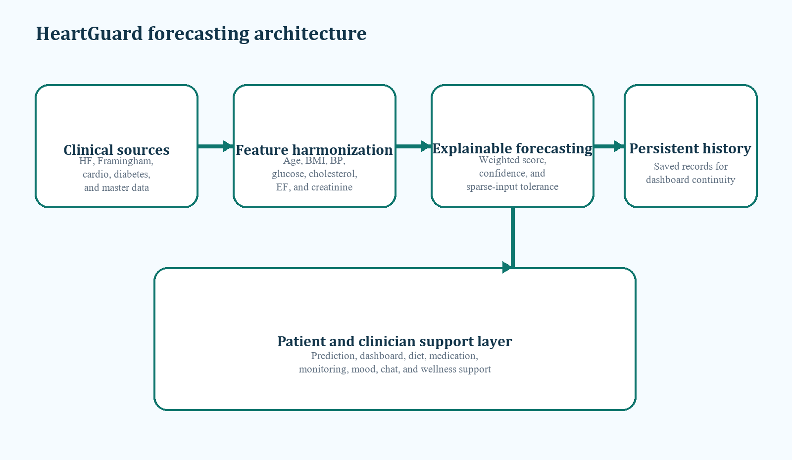

# HeartGaurd

HeartGaurd is a heart health web application with a FastAPI backend and a multi-page frontend. It helps users estimate cardiovascular risk, track prediction history, and get heart-health guidance from a chatbot.



## Features

- Heart risk prediction based on health metrics
- Prediction history saved to Excel (`data/final/predictions_history.xlsx`)
- Built-in heart-health chatbot (`/chat`)
- Static frontend pages served directly by FastAPI
- Local launcher scripts for Windows (`start_heartguard.vbs`, `start_heartguard.bat`)

## Tech Stack

- Backend: FastAPI, Pydantic, OpenPyXL
- Frontend: HTML, CSS, JavaScript (plus React prototypes under `frontend/react`)
- Server: Uvicorn

## Project Structure

```text
HeartGaurd/
  backend/              # FastAPI application
  frontend/             # Static frontend pages and assets
  data/                 # Prediction history and datasets
  notebooks/            # Analysis notebooks
  paper/                # Project documentation and architecture assets
  requirements.txt
  render.yaml
```

## API Endpoints

- `GET /api/health` - Health check
- `POST /predict` - Calculate risk prediction
- `GET /predictions` - Fetch prediction history
- `POST /chat` - Chatbot response endpoint

## Local Setup

1. Create and activate a Python virtual environment (recommended).
2. Install dependencies:

```bash
pip install -r requirements.txt
```

3. Start the server:

```bash
uvicorn backend.main:app --reload
```

4. Open:
- `http://127.0.0.1:8000`

## Quick Launch (Windows)

- Double-click `start_heartguard.vbs` to run in the background and open the site.
- If `.vbs` is blocked, run `start_heartguard.bat`.

## Deployment

This repo includes `render.yaml` for deployment on Render.

Notes:
- The app currently stores prediction history in an Excel file.
- On free cloud instances, local file storage may reset on restart/redeploy.
- For production durability, move storage to SQLite or PostgreSQL.

## Disclaimer

This project is for educational and informational purposes only and is not a substitute for professional medical advice, diagnosis, or treatment.
